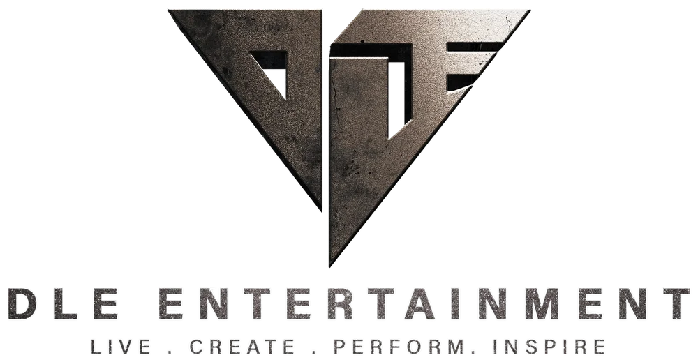

<div align="center">



# DLE Entertainment

**Elite infrastructure for artists who choose to Do Life Electric.**

*Live · Create · Perform · Inspire*

[](https://nextjs.org/)
[](https://react.dev/)
[](https://www.mongodb.com/atlas)
[](https://paymongo.com)
[](https://cloudinary.com)

</div>

---

## ✨ About

**DLE Entertainment** is a cinematic, full-stack entertainment platform built to support artists, showcase music, and connect fans with the roster. Fans can stream music, watch artist videos, send digital gifts to support talent, and reach out directly — all in a fast, mobile-optimized experience.

Created by **Samuel Barrientos** (DLE Entertainment).

---

## 🎬 Features

- 🎵 **Music Player** — Spotify-style persistent player with genres, album grouping, shuffle/repeat, gapless playback, and downloads for signed-in users
- 🎤 **Artist Roster** — Cinematic talent carousel with artist videos, bios, group/solo filters, and search
- 🎁 **Fan Gifts** — Secure gift/tip system via **PayMongo** (GCash, Maya, GrabPay, Cards, Banks, 7-Eleven) with PHP ₱ pricing
- 🎞️ **Announcement Popups** — Admin-scheduled announcements with fireworks/balloon effects, mobile-optimized
- 🎨 **Cinematic Design System** — Gold/black palette, Oswald/Montserrat/Inter/Pinyon typography, smooth animations
- 🌓 **Dark / Light Theme** — Cinematic pages forced dark; utility pages respect theme
- 🔐 **Google Sign-In** — Secure OAuth authentication; JWT sessions; granular admin permissions
- ☁️ **Cloudinary Media** — Auto-optimized images, audio, and video delivery via CDN
- 📱 **Mobile First** — Fully responsive; custom gestures; touch-friendly carousels
- ⚡ **Edge Cached** — Music, artists, and genres served from Vercel Edge CDN for instant global loads

---

## 🛠 Tech Stack

| Layer | Technology |
|---|---|
| **Framework** | [Next.js 14](https://nextjs.org/) (App Router) |
| **Frontend** | React 18, Tailwind CSS, Framer Motion |
| **Database** | [MongoDB Atlas](https://www.mongodb.com/atlas) with Mongoose ODM |
| **Authentication** | [NextAuth.js](https://next-auth.js.org/) (Google OAuth, JWT sessions) |
| **Payments** | [PayMongo](https://paymongo.com/) (BSP-licensed PH gateway) |
| **Media** | [Cloudinary](https://cloudinary.com) (images, audio, video) |
| **Deployment** | [Vercel](https://vercel.com) |
| **Email** | Resend / Nodemailer |

---

## 📸 Pages

| Route | Purpose |
|---|---|
| `/` | Homepage — hero, roster, music CTA, contact panel |
| `/about` | About DLE story and team |
| `/artists` | Full artist roster with videos & gifts |
| `/music` | Music library — browse by genre/album, stream & download |
| `/contact` | Contact form (Google sign-in required to send) |
| `/faq` | Frequently asked questions |
| `/login` | Google sign-in page |
| `/admin` | Admin dashboard — music, artists, genres, gifts, announcements, analytics |
| `/terms` · `/privacy` | Legal pages |

---

## 🚀 Getting Started

### Prerequisites

- **Node.js 18.17+**
- **npm** or **pnpm** / **yarn**
- A **MongoDB Atlas** cluster
- A **Google OAuth** client ID/secret (for sign-in)
- **Cloudinary** account (for media uploads in production)
- **PayMongo** account (for gifts/payments)

---

## 📁 Project Structure

```
dle-entertainment/
├── app/                      # Next.js App Router pages & API routes
│   ├── about/
│   ├── admin/                # Admin dashboard
│   ├── api/                  # Server API endpoints
│   │   ├── admin/
│   │   ├── announcements/
│   │   ├── artists/
│   │   ├── auth/             # NextAuth handlers
│   │   ├── contact/
│   │   ├── donations/        # Fan gift/payment flow
│   │   ├── genres/
│   │   ├── music/
│   │   ├── upload/           # Media upload (Cloudinary/local)
│   │   └── webhooks/paymongo/
│   ├── artists/
│   ├── contact/
│   ├── faq/
│   ├── login/
│   ├── music/
│   ├── privacy/
│   ├── terms/
│   ├── layout.js
│   ├── not-found.js
│   └── page.js               # Homepage
├── components/               # React components
│   ├── MusicPlayer.js
│   ├── ArtistCard.js
│   ├── TalentCarousel.js
│   ├── AnnouncementPopup.js
│   ├── VideoModal.js
│   ├── GiftDonation.js
│   ├── Navbar.js
│   ├── Footer.js
│   └── ...
├── lib/                      # Server-side utilities
│   ├── auth.js
│   ├── dbConnect.js
│   ├── cloudinary.js
│   └── covers.js
├── models/                   # Mongoose schemas
│   ├── Artist.js
│   ├── Music.js
│   ├── Genre.js
│   ├── Donation.js
│   ├── Announcement.js
│   └── Admin.js
├── public/                   # Static assets
│   ├── dlelogo/
│   └── dark-texture.webp
├── dns-preload.cjs           # Windows DNS fix for MongoDB SRV
├── next.config.js
├── tailwind.config.js
├── package.json
└── README.md
```

---

## 🎨 Design System

| Token | Value | Use |
|---|---|---|
| Gold | `#C9A84C` | Accent, buttons, highlights |
| Gold Dark | `#A8893A` | Hover states, gradients |
| Gold Light | `#E6C76A` | Bright accents |
| Dark | `#0A0A0A` | Cinematic page backgrounds |
| Dark Light | `#141414` | Cards, panels |
| Dark Card | `#1A1A1A` | Elevated surfaces |
| Ivory (light mode) | `#F7F3EB` | Light mode background |

**Typography**
- **Display** — Oswald (bold uppercase headings)
- **Body** — Inter
- **Script** — Pinyon Script (cursive accents)
- **About page** — Montserrat

---

## 👤 Roles & Permissions

| Role | Permissions |
|---|---|
| **Primary Owner** | Full access, identified by `OWNER_EMAIL` |
| **Co-Owner (super)** | Music, artists, gifts, analytics, announcements, admins |
| **Admin** | Granular per-module access (music, artists, gifts, analytics, announcements) |

---

## 💳 Gift Flow

1. Fan clicks **🎁 Gifts** on an artist card
2. Chooses a gift type & amount (₱)
3. Signs in with Google
4. Redirected to **PayMongo's hosted checkout** (GCash, Maya, Card, etc.)
5. PayMongo sends a signed webhook back to `/api/webhooks/paymongo`
6. Gift is recorded; success toast shown on return to site
7. Admin sees the gift in the **Gifts** tab with full export capability

---

## 🔒 Security

- Google OAuth 2.0 authentication
- JWT sessions with signed secrets
- HMAC webhook signature verification for PayMongo
- TLS/SSL everywhere (HSTS enforced by Vercel)
- Input sanitization & ObjectId validation on all API routes
- Rate-safe admin endpoints
- No hardcoded secrets in source
- Circuit-breaker on database connection to prevent cascading failures

---

## 📱 Progressive Performance

- Edge-cached public API responses (s-maxage + stale-while-revalidate)
- Cloudinary `f_auto,q_auto` WebP/AVIF image delivery with right-sized transformations
- Lazy-loaded below-the-fold images with explicit dimensions
- Responsive hero video (desktop/mobile variants)
- Next-track audio preloading for gapless playback
- DNS preconnect to MongoDB and Cloudinary
- Small initial JS payload (shared chunk ~87 KB)

---

## 📄 License

All rights reserved © **DLE Entertainment**.
This project and its contents are proprietary. Unauthorized copying, distribution, or commercial use is prohibited.

---

<div align="center">

**Redifining The Vision**

*Live · Create · Perform · Inspire*

Created by **Sammuel Barrientos** · DLE Entertainment

</div>
